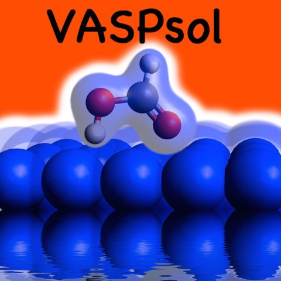

[](http://vaspsol.mse.ufl.edu/)

We have implemented an implicit solvation model that describes the effect of 
electrostatics, cavitation, and dispersion on the interaction between a solute 
and solvent into the plane-wave DFT code VASP. Our implementation provides a 
computationally efficient means to calculate the effects of solvation on molecules 
and crystal surfaces as well as reaction barriers. The strength of our solvation model 
implementation is its capability to handle large periodic systems such as metal and 
semiconductor surfaces and its interoperability with standard ultrasoft pseudopotential and 
projector-augmented wave potential libraries.

Prerequisites
===============
[VASP](http://www.vasp.at/) versions 5.2.12 or 5.3.3 or 5.3.5 or 5.4.1.

Compiler and library requirements are the same as that of VASP ([vasp wiki] (http://cms.mpi.univie.ac.at/wiki/index.php/Installing_VASP))

Installation
=============

For VASP versions >= 5.4.1:
----------------------------

These versions of VASP support solvation calculations out of the box.
The only thing that the user needs to do is to update the solvation routines by copying 
the **VASPsol/src/solvation.F** file to the src/ folder in the original VASP folder, **vasp.5.4.X/src/** and 
follow the install instructions for the compilation of the original VASP.

**Note:**

*VASP.5.4.1 by default compiles all the three binaries: standard one(vasp_std), gamma version(vasp_gamma) and 
the one for noncollinear calculations(vasp_ncl). Some users have reported in the past that the version 5.4.1 
compilation fails after updating the solvation related files. This was due to the fact that the solvation 
modules were written and tested using the real to complex FFTs(same as vasp_std and vasp_gamma) whereas 
the non-collinear compilation uses complex to complex FFTs. The issue has been fixed and all three binaries 
will compile fine without any errors.*

For VASP versions = 5.2.12 or 5.3.3 or 5.3.5:
----------------------------------------------

**Note:**

*VASP license prohibits us from distributing the patch files on a public platform like github.
If you would like to use VASPsol with VASP versions 5.2.12, 5.3.3 or 5.3.5, please contact 
Dr. Richard Hennig (rhennig[at]mse.ufl.edu) to obtain the required patch file.
Sorry for the inconvenience*

- Apply the appropriate interface patch to the original VASP source code. There are 3 interface_patch files 
available in the **VASPsol/patches** folder, one for each supported versions of VASP.
```   
    cd <VASP src directory>
    patch -p1 < <path to the interface patch file>
```
- After applying the patch, copy **VASPsol/src/solvation.F** file to the VASP source directory:
- In the original VASP Makefile, put solvation.o object file name before pot.o in that order.
- ``` make clean ```
- ``` make ```

**Note:**

The file **VASPsol/src/solvation.F** combines all the modules defined in the files in the folder 
**VASPsol/src/modules** so as to conform with the new builtin interface for solvation in vasp(versions >= 5.4.1).
The files in the **VASPsol/src/modules** folder do not play any role in the installation procedure.

Usage
======
Please see the file USAGE.md in the docs folder for instructions and the examples folder for some sample calculations.

References
===========
If you use the VASPsol package in your research, please cite the following paper:

Implicit solvation model for density-functional study of nanocrystal surfaces and reaction pathways.
 K. Mathew, R. Sundararaman, K. Letchworth-Weaver, T. A. Arias, and R. G. Hennig. J. Chem. Phys. 140, 084106 (2014), [doi:10.1063/1.4865107] (http://dx.doi.org/10.1063/1.4865107).

License
=========
VASPSol is released under the terms of Apache version 2.0 license:

*Copyright 2013-2015 Kiran Mathew and Richard Hennig

Licensed under the Apache License, Version 2.0 (the "License");
you may not use this file except in compliance with the License.
You may obtain a copy of the License at

    http://www.apache.org/licenses/LICENSE-2.0

Unless required by applicable law or agreed to in writing, software
distributed under the License is distributed on an "AS IS" BASIS,
WITHOUT WARRANTIES OR CONDITIONS OF ANY KIND, either express or implied.
See the License for the specific language governing permissions and
limitations under the License.*

For discussions and feedback
=============================
Join our mailing list: https://groups.google.com/forum/#!forum/vaspsol

Contributing
=============
Please contact Dr. Richard Hennig (rhennig[at]mse.ufl.edu)

Authors
========
Kiran Mathew

Dr. Richard Hennig